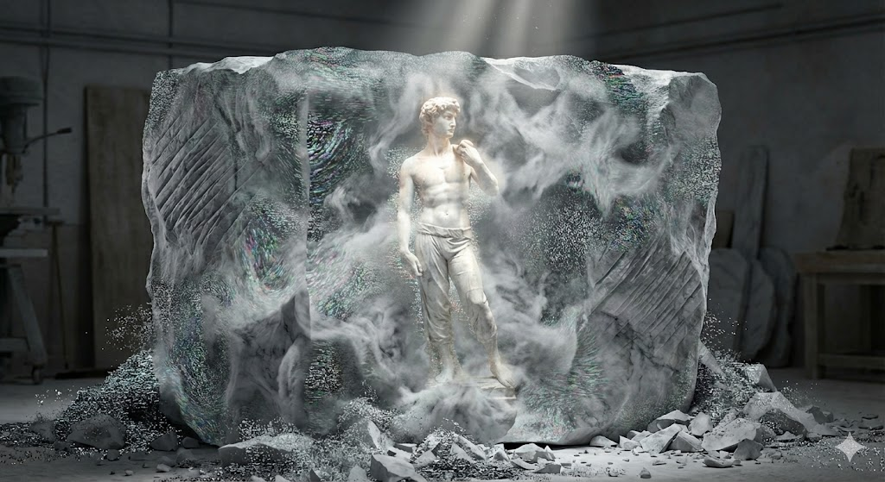
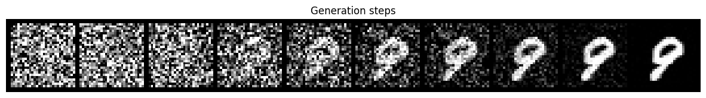

# learn-diffusion


“雕像本来就在石头里，我只是把不需要的部分去掉。”  
—— 米开朗基罗 (Michelangelo)  



在 Midjourney 和 Stable Diffusion 等生成式 AI 展现惊人能力的今天，不仅让人好奇：AI 究竟是如何从虚空中构建图像的？  
抛开复杂的 Latent Space 概念和晦涩的数学推导，本文将通过一个基于 MNIST（手写数字数据集）的轻量级 Diffusion 脚本，从代码逻辑层面解析扩散模型的核心——“加噪”与“去噪”过程。


## **01\. 并非绘画，而是“雕刻”**

大众对 AI 绘画常有一种误解，认为它像人类画家一样，是先勾勒轮廓再填充颜色。事实上，Diffusion 模型的工作方式并非“绘画”，而更接近于“雕刻”。  
其核心机制在于**去噪（Denoising）**。我们在代码中的 sample 函数里，可以清晰地看到这个“减法”过程：  

```python
# 核心采样循环：从第 1000 步倒推回第 1 步
for i in reversed(range(1, self.timesteps)):
    # 1. 预测当前画面中的"杂质" (predicted_noise)
    predicted_noise = model(x, t, labels)
    
    # 2. 从画面中减去杂质 (去噪公式)
    x = (1 / torch.sqrt(alpha)) * (
            x - ((1 - alpha) / (torch.sqrt(1 - alpha_hat))) * predicted_noise
    ) + torch.sqrt(beta) * noise

```

* **初始状态**：x 是一块完全无序的随机噪声，好比一块未经打磨的大理石。  
* **生成过程**：循环的每一步，模型都在计算 predicted\_noise，然后从当前的 x 中减去它。  
* **最终产出**：随着 1000 刀“雕刻”完毕，噪声被剔除，清晰的数字随之显现。

## **02\. 代码层面的三个核心逻辑**

为了实现这一过程，模型必须具备三个核心能力。在代码实现中，这对应着神经网络的三个关键模块：

### **第一课：时间步感知 (Time Embeddings)**

雕刻是一个分阶段的过程。初期（第 1000 步）需要大刀阔斧，后期（第 10 步）只能小心微调。模型必须知道“现在是第几步”。  
在代码中，我们使用正弦位置编码（Sinusoidal Position Embeddings）来赋予模型这种时间观念：  

```python
class SinusoidalPositionEmbeddings(nn.Module):
    def __init__(self, dim):
        super().__init__()
        self.dim = dim

    def forward(self, time):
        # ... 省略计算细节 ...
        # 生成基于正弦/余弦的时间指纹
        embeddings = torch.cat((embeddings.sin(), embeddings.cos()), dim=-1)
        return embeddings
```

如果不给神经网络输入这个 time，它就会像一个盲人雕塑家，不知道该用力凿还是轻轻磨，最终导致生成的图像结构崩塌。

### **第二课：条件引导 (Conditional Embedding)**

为了让模型生成特定的数字（如“5”）而非随机输出，我们必须给它植入“意图”。  
在 SimpleUNet 的结构中，我们通过 Embedding 层将数字标签（labels）转化为向量，并直接加到时间向量上：  

```python
class SimpleUNet(nn.Module):
    def __init__(self):
        # ...
        # 这里的 num_classes=10，对应 0-9 个数字
        self.label_emb = nn.Embedding(Config.num_classes, time_emb_dim)

    def forward(self, x, timestep, labels):
        t = self.time_mlp(timestep)
        c = self.label_emb(labels)
        
        # 关键点：将"时间"和"意图"融合
        t = t + c  
        
        # ... 后续网络计算 ...
```

这就是生成式 AI 能够精准响应指令（Prompt）的原理：它不是在凭空创造，而是在噪声中根据你的 labels 指引，搜索并保留符合该特征的像素。

### **第三课：通过“破坏”学习“重建” (Training via Noise Prediction)**

模型并非天生懂得如何“雕刻”（去噪），它是通过一种“逆向工程”训练出来的。我们先学会如何把一张好图毁掉，然后让 AI 学习如何恢复它。  
训练的本质就是不断执行这个 add\_noise 函数：  

```python
def add_noise(self, x, t):
    # 生成随机噪声
    noise = torch.randn_like(x)
    
    # 公式：x_t = √α_bar * 原图 + √(1-α_bar) * 噪声
    # 随着 t 增大，原图的成分越来越少，噪声成分越来越多
    x_t = sqrt_alpha_hat_t * x + sqrt_one_minus_alpha_hat_t * noise
    
    return x_t, noise
```

1. **破坏（Forward Process）**：我们利用 add\_noise 将清晰的数字变成噪点图。  
2. **学习（Backward Process）**：我们把噪点图 x\_t 丢给模型，问它：“你觉得刚才加进去的 noise 是什么样子的？”

一旦模型学会了预测噪声，它就拥有了逆转熵增的能力——从混沌中重构秩序。

## **03\. 还原过程的可视化**

经过多轮训练，模型便掌握了上述所有能力。  
下图展示了推理阶段路径：  



可以看到，初始画面完全由随机噪声构成。随着采样步数 从 1000 走向 1，数字的骨架逐渐浮现。这并非简单的图像叠加，而是模型在数学空间中，一步步将数据分布从“无序”推向“有序”的必然结果。

## **04\. 从 MNIST 到无限可能**

虽然这个脚本只生成了简单的 28x28 灰度数字，但它已经包含了现代生成式 AI 的所有核心 DNA。  
当我们把目光投向 Stable Diffusion 这样的大型模型时，它们无非是在此基础上做了两个关键升级：

1. 更大的“画布” (Latent Space)：  
   为了生成高清大图，算力消耗是巨大的。因此，现代模型不再直接在像素层面（Pixel Space）进行雕刻，而是先将图片压缩到一个更抽象、数据量更小的“潜空间”（Latent Space）中进行去噪，最后再通过解码器还原。这就好比雕塑家不再直接打磨巨大的原石，而是先制作一个精细的泥稿，最后再放大还原。  
2. 更强的“脑补” (CLIP/Text Encoder)：  
   它们引入了不仅能听懂“数字 5”，还能听懂“赛博朋克风格的猫”的超强文本编码器。这让条件引导（Conditional Embedding）的能力呈指数级飞跃。

一旦理解了这几百行代码背后的逻辑，那个曾经神秘莫测的 AI 黑盒就被打开了一角。所谓的“魔法”，不过是数学与算力在时间维度上的精妙共舞。